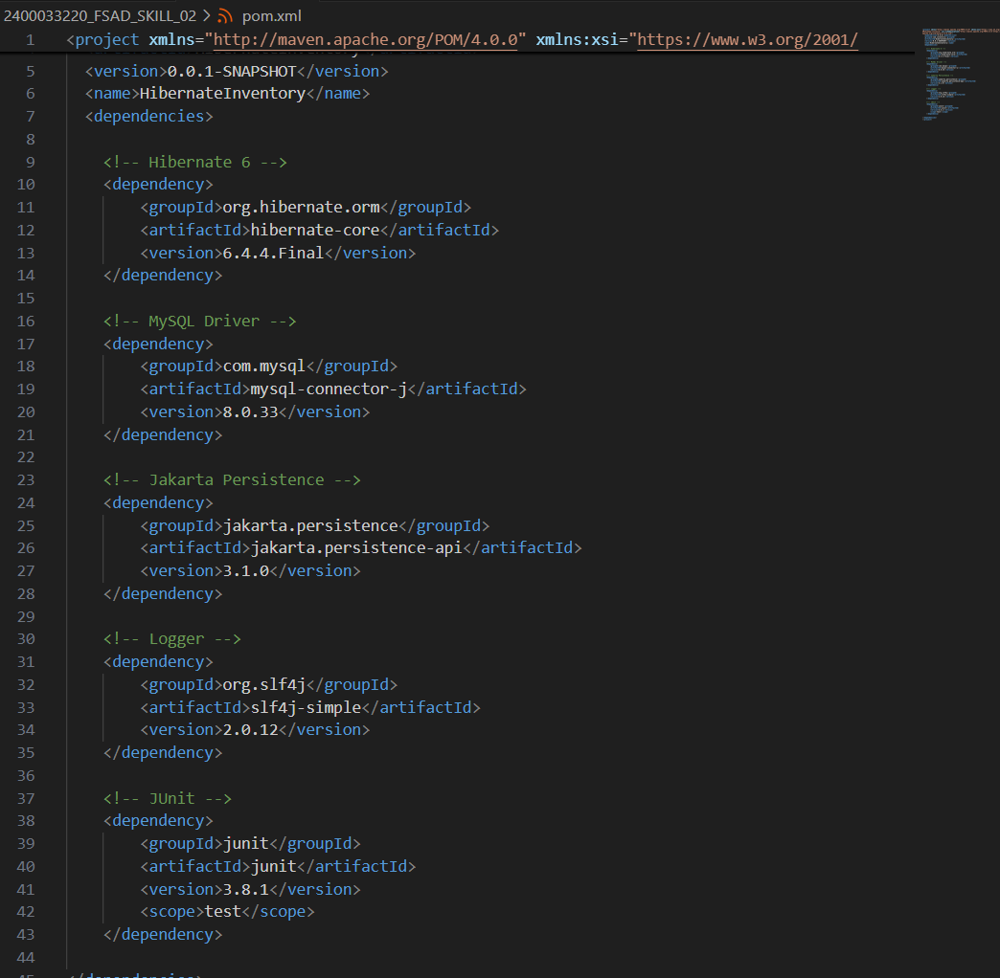
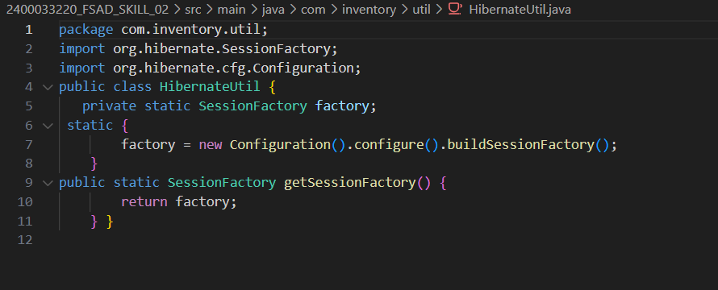
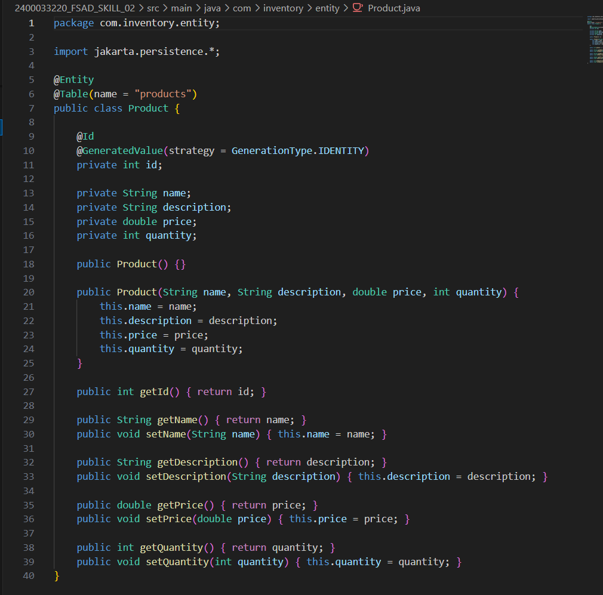
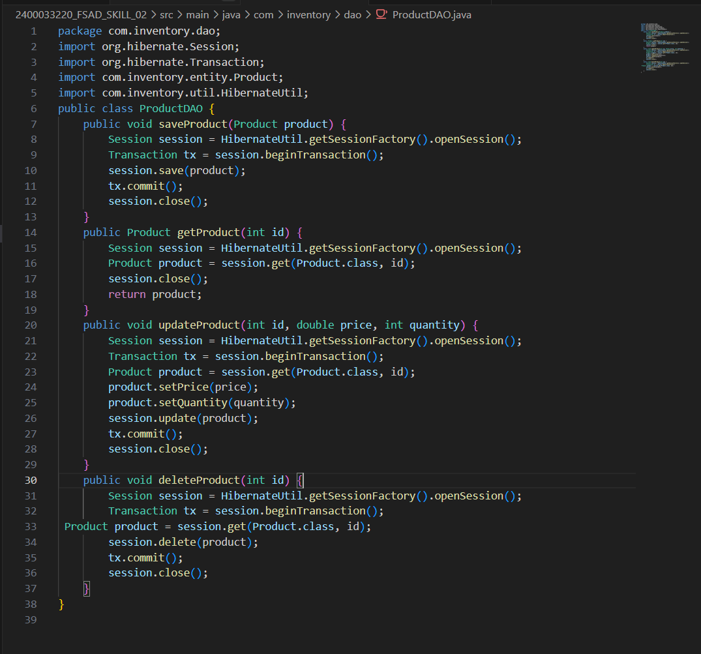

# 2400033220_FSAD_SKILL_02

# Skill 2 - Hibernate CRUD Operations

## Problem Statement

A retail inventory system needs to store product details such as `productId`, `name`, `description`, `price`, and `quantity`. The admin should be able to add new products, retrieve product information, update price or quantity, and delete discontinued products. 

Your task is to implement complete CRUD operations using Hibernate with proper entity mapping using JPA annotations. 

1. Create a Product entity with fields: `id` (primary key), `name`, `description`, `price`, `quantity`. 
2. Configure Hibernate and map the Product entity to a table using JPA annotations. 
3. Insert multiple Product records into the database. 
4. Retrieve a product using its `id`. 
5. Update the price or quantity of any selected product. 
6. Delete a product record by `id` if it is discontinued. 
7. **Note:**
   a. Implement Hibernate ID generation strategies (AUTO, IDENTITY, SEQUENCE) inside the entity to observe how primary key values differ. 
   b. The ID can be manual or auto generated, based on your chosen strategy. 
8. Push the Hibernate project into a single GitHub repository.

---

## Implementation Details & Screenshots

### 1. Maven Dependencies `pom.xml`
The required dependencies for Hibernate and database connector are configured here.

### 2. Hibernate Configuration `HibernateUtil`
The `HibernateUtil` class contains the configuration logic for initializing the `SessionFactory`.

### 3. Product Entity `Product`
The `Product` class is mapped as a JPA Entity using appropriate annotations for ID generation.

### 4. Product Data Access Object (CRUD Operations)
The `ProductDAO` handles all CRUD operations corresponding to the requirements (insert, retrieve, update, delete).

